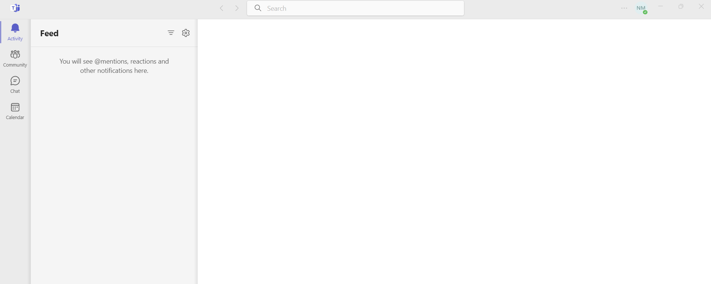

# Markdown-Training
# Exploring Microsoft Teams
Microsoft Teams has many features. For example,

* Activity
* Community
* Chat
* Calendar.
  

7 Using Microsoft Teams
Microsoft Teams helps you to connect with people and has many features such as chat, meeting, and group activities.
This section describes features of Microsoft Teams.
## Using Chat in Microsoft Teams meeting
You can send a text message, share files, react with emojis, and send GIF during a live meeting. You can show and hide the chat window.

### Send a message
This section describes how to send a message during Microsoft Teams meeting.

To send a message,

1. On the ribbon, click **Chat** to show the **Meeting chat** window.
1. Enter your text in **Type a new message** field and click **Send** icon.
`Note`: You can format the text as per your requirement. For more information on formatting, see Reference Guide.
1. (Optional) Click **Chat** again to hide the **Meeting chat** window.
 